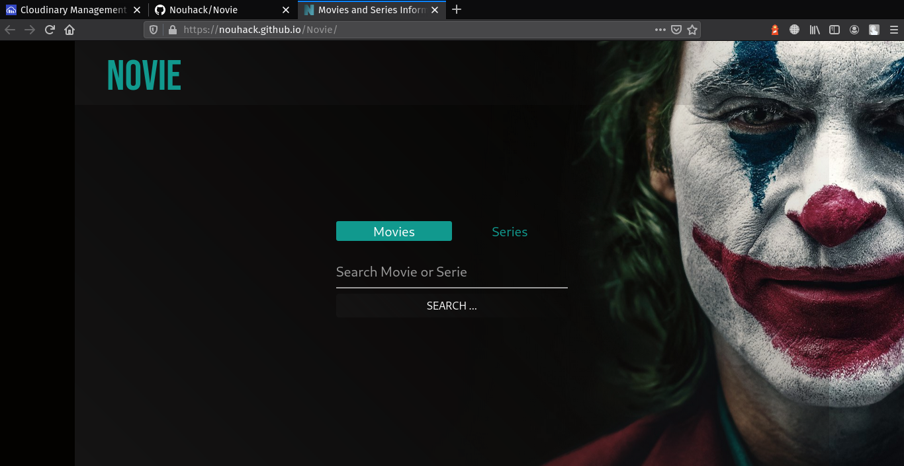
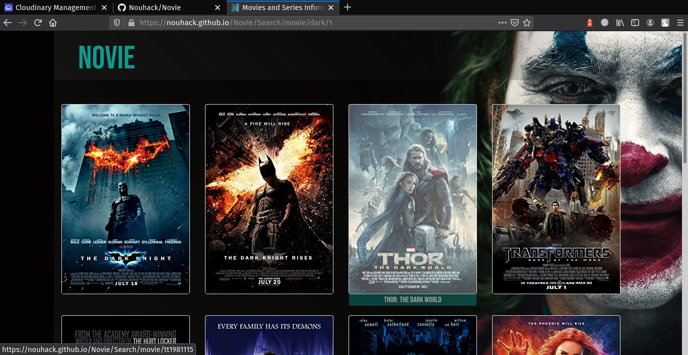
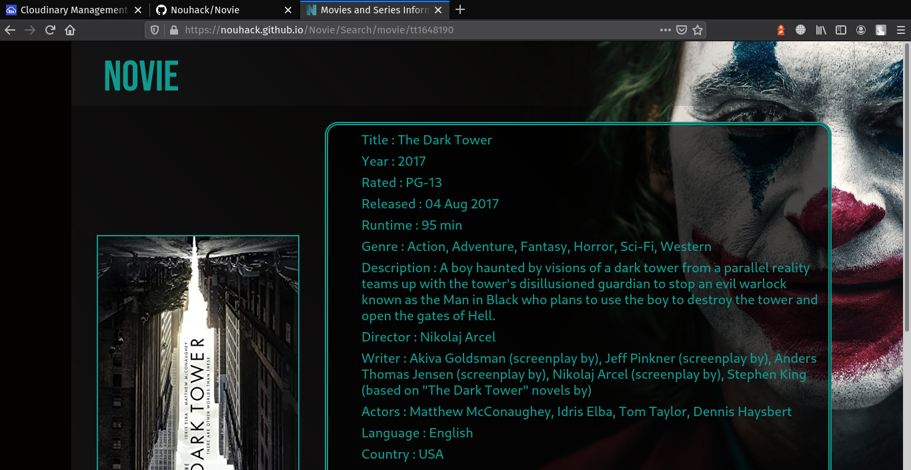
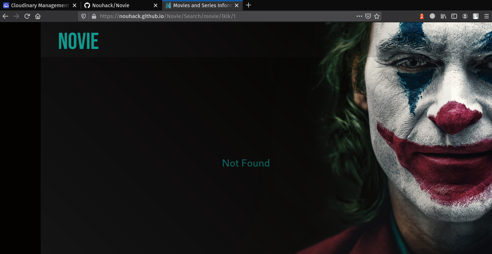

# About Novie Project

Novie project is a website that gives you informations and details about any serie or movie consuming The Open Movie Database API (OMDb)


# Visite the WebSite

<a href="https://nouhack.github.io/Novie/" target="_blank"></a>

# Getting Started with Create React App and Bootstrap

This project was bootstrapped with [Create React App](https://github.com/facebook/create-react-app) and styled using [Bootstrap](https://react-bootstrap.github.io/getting-started/introduction) (desktop and mobile responsive)

# Getting Started with project
==> install dependecies
```
npm install
```

==> start developement server

``` 
npm start
```

## ScreenShots
Main page:


research page:


detail page:


Not found  page:

